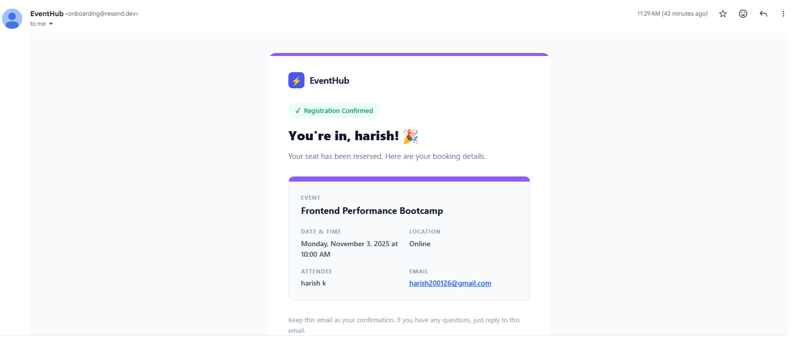

# EventHub — Event Booking Application

A full-stack event booking web application built with React + Node.js/Express.

---

## Tech Stack

| Layer | Tech |
|-------|------|
| Frontend | React 18, Vite, Tailwind CSS, TanStack Query v5 |
| Backend | Node.js, Express, express-validator, Helmet, Morgan |
| HTTP Client | Axios |
| Notifications | react-hot-toast |
| Date formatting | date-fns |

---

## Architecture

### Backend (`/api`) — Repository Pattern

```
api/src/
├── data/
│   └── store.js           # In-memory data (events + bookings)
├── repositories/
│   ├── eventRepository.js # Data access layer for events
│   └── bookingRepository.js
├── services/
│   ├── eventService.js    # Business logic for events
│   └── bookingService.js  # Booking rules & validation
├── controllers/
│   ├── eventController.js # HTTP request/response handlers
│   └── bookingController.js
├── routes/
│   └── index.js           # Route definitions + input validation
├── middlewares/
│   └── errorHandler.js    # Centralized error handling
└── index.js               # Express app entry point
```

### Frontend (`/client`) — Feature-based Structure

```
client/src/
├── components/
│   ├── ui/                # Reusable: Button, Input, Badge, Modal
│   ├── events/            # EventCard, EventGrid (with skeleton/empty/error states)
│   └── booking/           # BookingForm with client-side validation
├── hooks/
│   ├── useEvents.js       # React Query hook for fetching events
│   └── useBooking.js      # Mutation hook for booking + cache invalidation
├── services/
│   ├── apiClient.js       # Axios instance with interceptors
│   └── eventService.js    # API call functions
├── pages/
│   └── HomePage.jsx       # Main page
├── utils/
│   └── dateUtils.js       # Date formatting helpers
└── App.jsx                # QueryClientProvider + Toaster setup
```

---

## Features Implemented

### Core (Required)
- [x] Event listing with React Query (loading, error, success states)
- [x] Book Now with modal form (name + email)
- [x] Real-time seat decrement after booking
- [x] Sold Out state with disabled button
- [x] `GET /events` and `POST /book` endpoints

### Add-On (3 of 3 chosen)
- [x] Client-side form validation (name length, email format)
- [x] Success / error toast notifications (react-hot-toast)
- [x] Duplicate booking prevention (same email + event)
- [x] Environment-based API URL (`VITE_API_BASE_URL`)
- [x] Responsive layout (mobile → tablet → desktop grid)
- [x] Booking form in a modal

### Bonus
- [x] Clean folder abstraction (hooks, services, repositories, controllers)
- [x] Backend input validation (express-validator)
- [x] Reusable UI components (Button, Input, Badge, Modal)
- [x] Centralized error handling middleware
- [x] Security headers (Helmet), CORS, sanitization
- [x] CI/CD pipeline via GitHub Actions → Vercel
- [x] Booking confirmation email via Resend

---

## API Reference

### `GET /api/events`
Returns all events.

**Response 200:**
```json
{
  "success": true,
  "data": [
    {
      "id": "uuid",
      "title": "React Summit 2025",
      "date": "2025-08-15T09:00:00.000Z",
      "location": "Amsterdam, Netherlands",
      "description": "...",
      "totalSeats": 200,
      "availableSeats": 42,
      "category": "Technology",
      "imageColor": "#6366f1"
    }
  ]
}
```

### `POST /api/book`
Books a seat for an event.

**Request body:**
```json
{
  "eventId": "uuid",
  "name": "Jane Smith",
  "email": "jane@example.com"
}
```

**Response 201 (success):**
```json
{
  "success": true,
  "message": "Booking confirmed successfully!",
  "data": {
    "booking": { "id": "uuid", "eventId": "...", "name": "...", "email": "...", "bookedAt": "..." },
    "availableSeats": 41
  }
}
```

**Error responses:**
- `404` — Event not found
- `409` — No seats available / duplicate booking
- `422` — Validation failed

---

## Getting Started

### Prerequisites
- Node.js v18 or higher
- npm v9 or higher

---

### Step 1 — Clone / Extract

```bash
# If using zip:
unzip event-booking-app.zip
cd event-booking-app
```

---

### Step 2 — Install Dependencies

**Backend:**
```bash
cd api
npm install
cd ..
```

**Frontend:**
```bash
cd client
npm install
cd ..
```

---

### Step 3 — Configure Environment

The frontend needs to know the backend URL.

```bash
# client/.env already exists with default:
# VITE_API_BASE_URL=http://localhost:4000/api
```

If you change the API port, update `client/.env` accordingly.

---

### Step 4 — Run the Application

Open **two terminal windows**:

**Terminal 1 — Start API:**
```bash
cd api
npm run dev
# API running at http://localhost:4000
```

**Terminal 2 — Start Frontend:**
```bash
cd client
npm run dev
# App running at http://localhost:5173
```

Open your browser at **http://localhost:5173**

---

### Step 5 — Verify API is working

```bash
curl http://localhost:4000/health
# {"status":"ok","timestamp":"..."}

curl http://localhost:4000/api/events
# {"success":true,"data":[...]}
```

---

## Deployment

### Backend — Railway

1. Push repo to GitHub
2. Go to [railway.app](https://railway.app) → **New Project** → **Deploy from GitHub repo**
3. In **Settings → Source**, set **Root Directory** to `api`
4. Railway auto-detects Node.js and runs `npm install` + `npm start`
5. Add environment variables in the **Variables** tab:

| Key | Value |
|-----|-------|
| `NODE_ENV` | `production` |
| `PORT` | `4000` |
| `CLIENT_URL` | `https://your-frontend.vercel.app` |

6. Railway provides a public URL: `https://your-app.up.railway.app`

### Frontend — Vercel (via GitHub Actions CI/CD)

Deployments are automated. Every push to `main` triggers the workflow at `.github/workflows/deploy.yml`.

#### One-time Vercel setup

1. Go to [vercel.com](https://vercel.com) and import your GitHub repo
2. Set **Root Directory** to `client`
3. Set **Build Command** to `npm run build` and **Output Directory** to `dist`
4. Add environment variable: `VITE_API_BASE_URL=https://your-app.up.railway.app/api`

#### One-time GitHub Secrets setup

In your repo → **Settings → Secrets and variables → Actions**, add:

| Secret | How to get it |
|--------|---------------|
| `VERCEL_TOKEN` | Vercel dashboard → Account Settings → Tokens |
| `VERCEL_ORG_ID` | Run `vercel whoami` or found in `.vercel/project.json` after first `vercel link` |
| `VERCEL_PROJECT_ID` | Found in `.vercel/project.json` after running `vercel link` in `client/` |

#### The CI/CD workflow

```yaml
# .github/workflows/deploy.yml
name: Deploy to Production
on:
  push:
    branches:
      - main
jobs:
  deploy:
    runs-on: ubuntu-latest
    steps:
      - uses: actions/checkout@v4
      - name: Install Vercel CLI
        run: npm install -g vercel
      - name: Deploy to Vercel
        run: vercel --prod --token=${{ secrets.VERCEL_TOKEN }}
        env:
          VERCEL_ORG_ID: ${{ secrets.VERCEL_ORG_ID }}
          VERCEL_PROJECT_ID: ${{ secrets.VERCEL_PROJECT_ID }}
```

Every push to `main` → GitHub Actions runs → Vercel deploys the latest frontend automatically.

---

## Assumptions & Limitations

- **In-memory storage**: All data resets on server restart. No persistence.
- **No auth**: Anyone with the same email can be blocked from re-booking, but there is no authentication.
- **Duplicate check**: Based on `eventId + email` combination only.
- **No pagination**: All events are returned in a single request (suitable for small datasets).
---

## Email Notifications

After every successful booking, an automated confirmation email is sent to the attendee using [Resend](https://resend.com).

### Email Template Preview

<!-- Add your screenshot here -->


### What's included in the email

- Event name, date & time, and location
- Attendee name and email
- Color-coded header matching the event's theme color
- Clean, mobile-friendly HTML template

### Setup

1. Sign up at [resend.com](https://resend.com) and grab your API key
2. Add it to `api/.env`:
```env
   RESEND_API_KEY=re_xxxxxxxxxxxxxxxx
```
3. For development, emails can only be sent to your Resend signup email unless you verify a domain
4. For production, verify your domain in Resend → **Domains** → Add Domain, then update:
```javascript
   // api/src/services/emailService.js
   const FROM_ADDRESS = "EventHub <noreply@yourdomain.com>";
```

### How it works

- Email is fired **after** the booking is saved — non-blocking, so if Resend is down the booking still succeeds
- In development, set `RESEND_TEST_EMAIL` in `api/.env` to redirect all emails to yourself:
```env
  RESEND_TEST_EMAIL=you@gmail.com
```

| Environment | Sends to |
|-------------|----------|
| Development (no domain) | Your Resend signup email only |
| Development (with `RESEND_TEST_EMAIL`) | Your test email |
| Production (verified domain) | Any recipient |
---

## What I'd Improve Next

- Add a database (PostgreSQL + Prisma) for persistence
- JWT-based authentication
- Admin dashboard to create/manage events
- Booking cancellation flow
- Email confirmation via SendGrid/Resend/NodeMailer
- Pagination + filtering/search for events
- Unit + integration tests (Vitest, Supertest)
